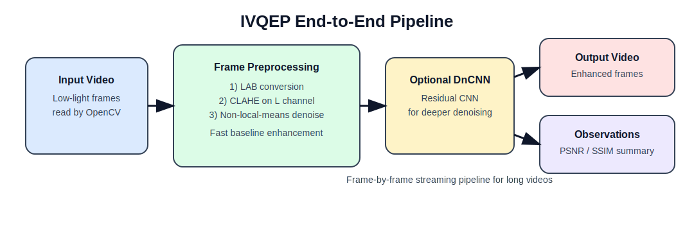

# IVQEP — End-to-End Repor

## 1) The problem

Low-light videos are usually hard to use.  
They look dark, noisy, and details are lost.  
This is a problem in places like CCTV footage, night driving videos, and medical/scientific recordings.

## 2) Use cases

- Improve night-time surveillance clips so objects are easier to see
- Clean noisy low-light videos before further computer vision work
- Compare enhancement quality with objective metrics (PSNR, SSIM)
- Build a reusable pipeline for dataset-level video enhancement

## 3) Why I built this

I wanted one practical pipeline that can:

1. Improve frame contrast
2. Remove noise
3. Optionally use a CNN for better denoising
4. Give measurable output quality

So instead of manually editing videos, the same process can run on full videos frame by frame.

## 4) My approach

I used a hybrid approach:

- **Classical image processing first** (fast and stable): CLAHE + non-local-means
- **Deep denoising second** (optional): DnCNN model in PyTorch
- **Quality check** (optional): PSNR and SSIM against a reference video

This gives a good balance between speed and quality.

## 5) Methodology

For each frame in the input video:

1. Read frame using OpenCV
2. Convert frame to LAB color space
3. Apply CLAHE on L-channel to improve visibility
4. Apply non-local-means to reduce noise
5. (Optional) Pass frame through DnCNN for deeper denoising
6. Write enhanced frame to output video
7. (Optional) Compute PSNR and SSIM if reference frame is available

The pipeline is streaming and frame-based, so it works for long videos too.

## 6) Tools used

- **Python** - overall implementation
- **OpenCV** - video I/O and preprocessing
- **PyTorch** - DnCNN model and inference
- **scikit-image** - PSNR and SSIM
- **NumPy** - frame array operations
- **tqdm** - progress tracking
- **pytest** - tests

## 7) Architecture



Flow summary:

`Input Video -> Frame Preprocessing -> (Optional) DnCNN -> Output Video + Metrics`

## 8) Output / observations

- Dark frames become brighter and more readable after CLAHE
- Noise is reduced in two stages (classical + optional CNN)
- The pipeline returns processing summary (frames processed, average metrics when enabled)
- When a clean reference is provided, PSNR/SSIM help verify quality gains

## 9) Project structure

```text
IVQEP/
├── pipeline/
│   ├── preprocessing.py
│   ├── denoising.py
│   ├── metrics.py
│   └── video_pipeline.py
├── tests/
├── main.py
└── requirements.txt
```

## 10) How to recreate this (simple git commands)

```bash
# 1) Clone
git clone https://github.com/Raj-Purohith-Arjun/IVQEP.git

# 2) Enter project
cd IVQEP

# 3) Install dependencies
pip install -r requirements.txt

# 4) Run tests
python -m pytest tests/ -v

# 5) Run pipeline (basic)
python main.py input.mp4 -o enhanced.mp4

# 6) Run pipeline (with checkpoint + metrics)
python main.py input.mp4 -o enhanced.mp4 --checkpoint weights/dncnn.pth --reference clean.mp4 --metrics
```

## 11) Quick CLI examples

```bash
# Preprocessing only
python main.py input.mp4 -o enhanced.mp4

# Limit number of processed frames
python main.py input.mp4 -o out.mp4 --max-frames 200
```
